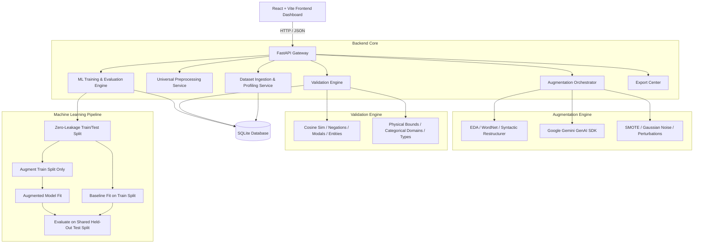

# Milestone 05: Technical Architecture

## 1. System Architecture Overview

```mermaid
flowchart TD
    Client[React + Vite Frontend Dashboard] -->|HTTP / JSON| API[FastAPI Gateway]
    
    subgraph Backend Core
        API --> DS_Service[Dataset Ingestion & Profiling Service]
        API --> Preproc_Service[Universal Preprocessing Service]
        API --> Aug_Service[Augmentation Orchestrator]
        API --> Val_Service[Validation Engine]
        API --> Train_Service[ML Training & Evaluation Engine]
        API --> Export_Service[Export Center]
    end

    subgraph Augmentation Engine
        Aug_Service --> Text_Aug[EDA / WordNet / Syntactic Restructurer]
        Aug_Service --> Gemini_Aug[Google Gemini GenAI SDK]
        Aug_Service --> Tabular_Aug[SMOTE / Gaussian Noise / Perturbations]
    end

    subgraph Validation Engine
        Val_Service --> Text_Val[Cosine Sim / Negations / Modals / Entities]
        Val_Service --> Tabular_Val[Physical Bounds / Categorical Domains / Types]
    end

    subgraph Machine Learning Pipeline
        Train_Service --> Split[Zero-Leakage Train/Test Split]
        Split --> Baseline[Baseline Fit on Train Split]
        Split --> AugTrain[Augment Train Split Only]
        AugTrain --> AugModel[Augmented Model Fit]
        Baseline --> TestEval[Evaluate on Shared Held-Out Test Split]
        AugModel --> TestEval
    end

    DS_Service --> DB[(SQLite Database)]
    Val_Service --> DB
    Train_Service --> DB
```
