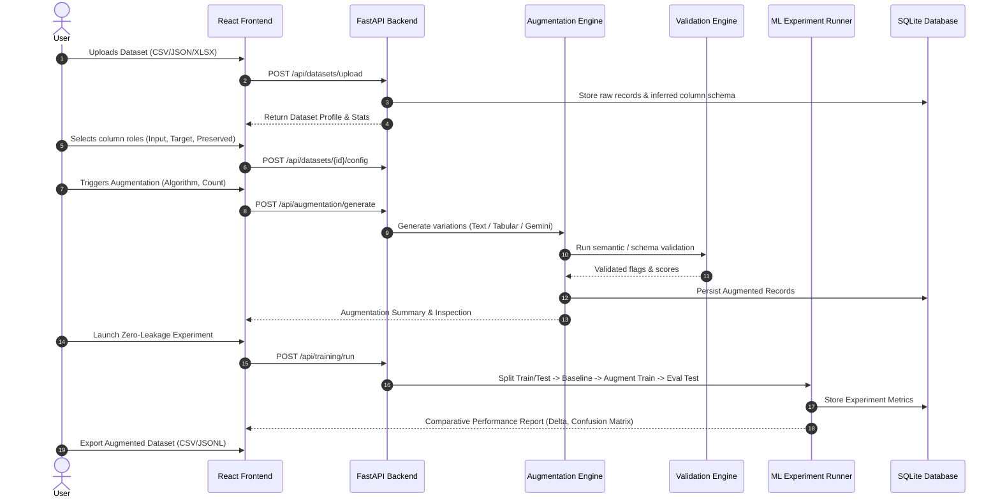

# Milestone 07: Project Workflow

## 1. End-to-End Operational Workflow

```mermaid
sequenceDiagram
    autonumber
    actor User
    participant UI as React Frontend
    participant API as FastAPI Backend
    participant Aug as Augmentation Engine
    participant Val as Validation Engine
    participant ML as ML Experiment Runner
    participant DB as SQLite Database

    User->>UI: Uploads Dataset (CSV/JSON/XLSX)
    UI->>API: POST /api/datasets/upload
    API->>DB: Store raw records & inferred column schema
    API-->>UI: Return Dataset Profile & Stats
    User->>UI: Selects column roles (Input, Target, Preserved)
    UI->>API: POST /api/datasets/{id}/config
    User->>UI: Triggers Augmentation (Algorithm, Count)
    UI->>API: POST /api/augmentation/generate
    API->>Aug: Generate variations (Text / Tabular / Gemini)
    Aug->>Val: Run semantic / schema validation
    Val-->>Aug: Validated flags & scores
    Aug->>DB: Persist Augmented Records
    Aug-->>UI: Augmentation Summary & Inspection
    User->>UI: Launch Zero-Leakage Experiment
    UI->>API: POST /api/training/run
    API->>ML: Split Train/Test -> Baseline -> Augment Train -> Eval Test
    ML->>DB: Store Experiment Metrics
    ML-->>UI: Comparative Performance Report (Delta, Confusion Matrix)
    User->>UI: Export Augmented Dataset (CSV/JSONL)
```
